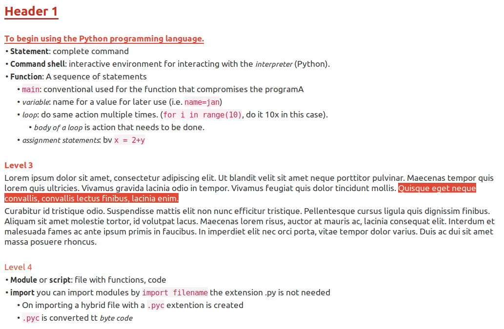

# Zim-Things

## Theme style.conf

Zim Desktop Wiki is a great tool, but the original green coloring with big headers is not to my liking. Over the months I updated my ``style.conf`` file.

To use this style for Zim copy the file and replace the original file on your computer (for Linux users in ``~/.config/zim/style.conf``)

## Bibliographies and Zim Wiki

Information will follow. See [Frank Donnely’s article](https://atcoordinates.info/tag/zim-wiki/) for a great explanation. I've added some comments in his [script](./bibscript.py) to extract all the references so you know what to change.

Because Zim doesn’t support markdownstyle citations (i.e. [@author2001] and blockquotes I use the markdownstyle for these element in my Wiki and convert my pages to markdown and Pandoc if needed

